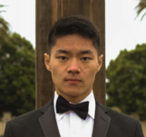

# Michael Mao



Use `section links` to skip to a specific section!

[About Me](###about-me)

[Education](###education)

[Relevant Coursework](###relevant-coursework)

[Future Coursework](###future-coursework)

[Contact Information](###contact-information)

### About Me

Hi, my name is Michael Mao, I'm a second-year student studying Computer Science at UC San Diego. I'm looking to improve my skills and become a software engineer!

Favorite Hobbies:
1. Video games
2. Sports
3. Cooking

My favorite quote, in the words of Professor Powell:

> Sporks suck!

### Education

**University of California San Diego**

BS in Computer Science, Anticipated December 2022

GPA: 3.77

Major GPA: 4.0

### Relevant Coursework

- CSE 11
- CSE 12
- CSE 15L
- CSE 21
- CSE 30
- CSE 100
- CSE 105
- CSE 140
- CSE 140L

### Future Coursework

- [x] CSE 101
- [x] CSE 110
- [ ] CSE 103
- [ ] CSE 142
- [ ] CSE 142L

### Contact Information

[LinkedIn](https://linkedin.com/in/michaelmaoucsd/)
 
 ```
 
 
 
 
 
 
 
 
 
 
 
 ```
 
[~~*secret button*~~](SECRET.md)
